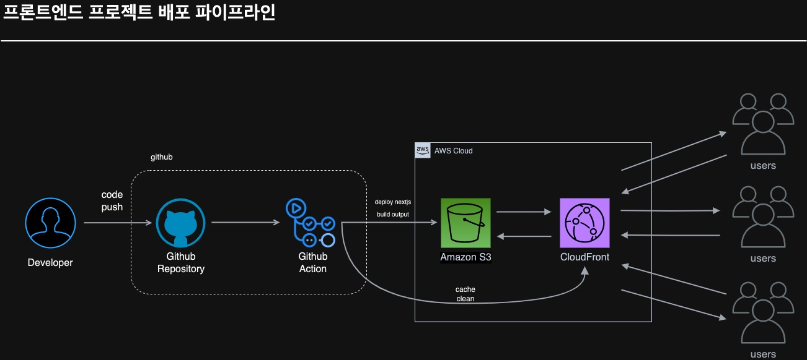

# 프론트엔드 프로젝트 배포 파이프라인 구성

## 목차

1. 개요
2. 배포 과정 설명
   - 2.1 GitHub Actions Workflow 개요 및 동작 방식
   - 2.2 Workflow에서 사용된 값들에 대한 설명
3. 주요 링크
4. 주요 개념 설명
5. CloudFront 캐싱 적용 전후 속도 비교

## 1. 개요

이 프론트엔드 프로젝트의 파이프라인은 **Next.js 프로젝트**를 AWS S3와 CloudFront를 활용하여 배포하며, GitHub Actions를 통해 CI/CD 작업을 자동화한다.

---

## 2. 배포 과정 설명

### 2.1 개발자가 코드를 push하기 이전의 과정

- 개발자는 로컬 환경에서 Next.js 프로젝트를 개발한다.
- 한 feature의 개발이 끝나면 코드 리뷰이후 원격 main branch에 해당 기능을 머지한다.

### 2.2 GitHub Actions Workflow 개요 및 동작 방식

GitHub Actions는 개발자가 코드를 원격 저장소의 기본 브랜치(main)에 push하면 자동으로 트리거된다. 이후 다음과 같은 단계를 거쳐 배포가 이루어진다.

#### Workflow 동작 흐름:

1. **Trigger**:
   - `main` 브랜치에 push 이벤트가 발생하거나, 수동으로 workflow가 실행된다.
2. **Checkout Repository**:

   - `actions/checkout@v2`를 사용하여 저장소의 코드를 가져온다.

3. **pnpm 설치 및 설정**:

   - `pnpm/action-setup@v4`와 `actions/setup-node@v4`를 사용하여 pnpm과 Node.js 환경을 설정한다.

4. **Dependencies 설치**:

   - `pnpm install --frozen-lockfile` 명령어로 의존성을 설치한다.

5. **Build**:

   - `pnpm build` 명령어로 Next.js 프로젝트를 빌드하여 정적 파일을 생성한다.

6. **AWS 자격 증명 설정**:

   - `aws-actions/configure-aws-credentials@v1`을 사용하여 S3와 CloudFront에 접근할 AWS 자격 증명을 설정한다.

7. **S3에 배포**:

   - 빌드된 정적 파일을 S3 버킷에 업로드하며, 기존 파일은 삭제(`--delete`)된다.

8. **CloudFront 캐시 무효화**:
   - CloudFront의 캐시를 무효화하여 최신 파일이 사용자에게 제공되도록 한다.

### 2.2 Workflow 동작을 위한 Repository Secret과 환경 변수

GitHub Secrets는 민감한 정보를 안전하게 저장하고 워크플로우에서 사용할 수 있도록 지원하는 기능이다.

AWS 자격 증명(AWS_ACCESS_KEY_ID 등), S3 버킷 이름, CloudFront 배포 ID 등을 Secrets에 저장하여 보안을 유지하면서도 자동화를 구현한다.

- `secrets.AWS_ACCESS_KEY_ID` 및 ` secrets.AWS_SECRET_ACCESS_KEY`:
  AWS IAM 사용자의 액세스 키와 비밀 키.
- `secrets.AWS_REGION`:
  S3와 CloudFront가 위치한 AWS 리전.
- `$secrets.S3_BUCKET_NAME`:
  정적 파일을 저장하는 S3 버킷 이름.
- `secrets.CLOUDFRONT_DISTRIBUTION_ID`:
  CloudFront 배포 ID로, 캐시 무효화를 위해 필요함.

---

## 3. 주요 링크

- **S3 버킷 웹사이트 엔드포인트**: hanghae3-front-test4-1.s3-website-ap-southeast-2.amazonaws.com
- **CloudFront 배포 도메인 이름**: d1p4p9l84mu8ql.cloudfront.net

---

## 4. 주요 개념 설명

### GitHub Actions과 CI/CD 도구

GitHub Actions는 코드 변경 사항에 따라 자동으로 빌드, 테스트, 배포 작업을 실행할 수 있는 CI/CD 도구이다. 이를 통해 개발자는 반복적인 작업을 자동화하고, 코드 품질과 배포 속도를 향상시킬 수 있다.

- CI(Continuous Integration): 코드 변경 사항을 병합할 때마다 자동으로 테스트 및 빌드를 수행하여 코드 품질을 유지한다.
- CD(Continuous Deployment): 테스트를 통과한 코드를 자동으로 배포하여 최신 상태를 유지한다.

### S3와 스토리지

AWS S3(Simple Storage Service)는 객체 스토리지 서비스로, 정적 웹사이트 호스팅 기능을 제공한다.

- 역할: Next.js 빌드 결과물(정적 파일)을 저장하고 사용자에게 제공.
- 장점: 높은 내구성과 가용성, 비용 효율성.

### CloudFront와 CDN (Content Delivery Network)

AWS CloudFront는 콘텐츠 전송 네트워크(CDN) 서비스로, 전 세계 엣지 로케이션에서 콘텐츠를 캐싱하여 사용자에게 빠르게 전달한다.

- 역할: 콘텐츠 전송 속도 향상 및 사용자 경험 개선.
- 장점: 글로벌 엣지 네트워크 활용, HTTPS 지원, DDoS 방어 기능 포함.

### 캐시 무효화 (Cache Invalidation)

CloudFront는 콘텐츠를 캐싱하기 때문에 변경된 파일이 즉시 반영되지 않을 수 있다. 이를 해결하기 위해 캐시 무효화를 실행하여 최신 콘텐츠가 사용자에게 제공되도록 한다.

- 방법: 특정 경로나 전체 경로(`/*`)를 지정하여 캐시를 무효화.

---
